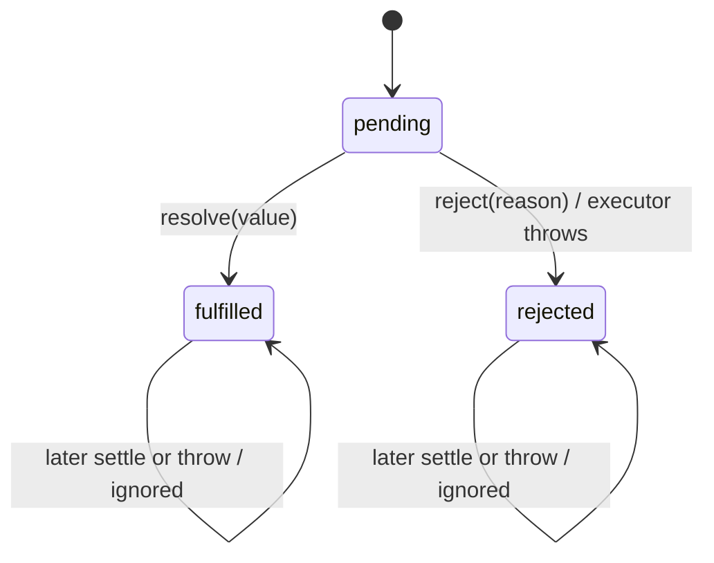
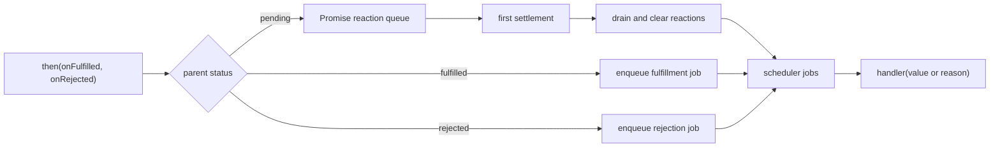

# P01 第一阶段检查点：状态机、Reactions 与调度边界

> 检查点日期：2026-07-26
>
> 对应课程：P01-L02、P01-L03
>
> 下一课程：P01-L04 · 让 `then` 返回新的 Promise

## 本阶段目标

第一阶段建立一个可测试的 Promise 核心，而不是提前完成完整的 Promise/A+：

- 用三态状态机保存一次且不可逆的 settlement；
- 把 executor、settlement 与 reaction handler 的执行时机分开；
- pending 时登记 reactions，settled 后把匹配的 handler 交给 scheduler；
- 用可控 test scheduler 验证时序，用 runtime scheduler 对齐 microtask；
- 保留明确的实现边界，为下一阶段的 child Promise 和传播矩阵留出空间。

## 已完成范围

### 状态机

- executor 在构造期间同步执行且只执行一次，并收到 `resolve` 与 `reject`；
- 未调用两者时保持 `pending`；
- `resolve(value)` 保存原始 value 并进入 `fulfilled`；
- `reject(reason)` 保存原始 reason 并进入 `rejected`；
- 第一次 settlement 获胜，后续 resolve/reject 静默忽略；
- executor 抛错等价于 `reject(error)`；
- executor 在 resolve 后抛错不会覆盖已确定的结果。

学习阶段通过 `getSnapshot()` 暴露判别联合：

```ts
type State =
  | { status: "pending" }
  | { status: "fulfilled"; value: any }
  | { status: "rejected"; reason: any };
```

这是测试可观察性决定 A2：它让 TypeScript 能根据 `status` 收窄结果。它不是标准 Promise API；进入标准化阶段后应删除或收紧。

### Reaction queue

每次 `then` 登记一条固定结构的 reaction：

```ts
type Reaction = [
  onFulfilled?: FulfillCallback,
  onRejected?: RejectCallback
];
```

处理规则：

| 注册时状态 | 行为 |
| --- | --- |
| `pending` | 保存 reaction，等待 settlement |
| `fulfilled` | 不再长期保存，异步安排 `onFulfilled(value)` |
| `rejected` | 不再长期保存，异步安排 `onRejected(reason)` |

settlement 后，已有 reactions 按注册顺序转换成 scheduler jobs，并释放原队列。job closure 已独立捕获 callback 与 result，因此清空 reaction queue 不影响未来执行。

### Scheduler 边界

Promise 核心只依赖最小接口：

```ts
type Scheduler = {
  enqueue: (job: () => void) => void;
};
```

当前有两个实现：

| Scheduler | 目的 | 执行方式 |
| --- | --- | --- |
| `createTestScheduler()` | 确定性单元测试 | `flushNext()` / `flushAll()` 手动执行 |
| `runtimeScheduler` | 默认运行时 | `queueMicrotask(job)` 自动执行 |

`Job` 始终是零参数函数。Promise handler 接收 value/reason，Promise 通过 closure 把参数封装到 job 内，scheduler 不理解 Promise 状态或结果。

## 机制图

### 状态不可逆



### Reaction 的所有权转移



## 测试证据

当前共有 17 条 Vitest 测试：

| 测试组 | 数量 | 证明内容 |
| --- | ---: | --- |
| 状态机 | 8 | executor、三态、first-settlement-wins、抛错路径 |
| Test scheduler | 3 | enqueue 不 inline、`flushNext` 单步、`flushAll` FIFO |
| Reactions | 5 | pending/settled 两种注册时机、fulfilled/rejected、多个 handlers |
| Runtime microtask | 1 | 默认 scheduler 在同步代码后、microtask checkpoint 内执行 handler |

多 reaction 测试还组合证明：

- settlement 前后注册的 handlers 都不会丢失；
- FIFO 与注册顺序一致；
- 第二次 resolve 不覆盖第一次 value，也不重复安排 jobs；
- 第二次 flush 不重复执行已消费的 jobs；
- 所有 handlers 收到的是第一次 settlement 的同一个对象。

验证命令：

```bash
pnpm test
pnpm typecheck
```

本检查点记录时的期望结果：17 tests passed，TypeScript `--noEmit` 通过。

## 关键失败与修正

| 失败或假阳性 | 根因 | 修正后的不变量 |
| --- | --- | --- |
| pending reaction 测试错误放过提前 enqueue | closure 在 flush 时才读取已更新的 value | resolve 前先 flush，pending handler 必须仍为 0 次 |
| resolve/reject 各自维护决定标志 | 两条路径可能不知道该相信哪个标志 | 使用一个共享 settlement latch，第一次调用获胜 |
| `vi.fn(() => {})` 的 `mock.calls[0][0]` 报 TS2493 | 零参数实现让调用参数被推导为元组 `[]` | 用 `vi.fn<FulfillCallback>` 声明 handler 契约 |
| events 数组内容相同但 `toBe` 失败 | `toBe` 比较对象身份 | 事件序列用 `toEqual`，原始 value/reason 身份用 `toBe` |
| 默认 scheduler 中 handler 永远不执行 | 默认使用了不可访问、无人 flush 的 test queue | test scheduler 保留手动队列；runtime scheduler 使用 microtask |
| 连续 `shift()` 排空 reactions | 数组反复重排，最坏 O(n²) | 线性遍历后释放 reaction queue |

这些修正体现的共同方法是：测试不仅要失败，还必须因为目标行为缺失而失败，并且目标实现必须能够使它转绿。

## 当前设计决定

1. **状态和订阅分离。** 一个 Promise 只有一个状态机，但可以有多个 reactions。
2. **settlement 和通知分离。** resolve/reject 决定结果；scheduler 决定 handler 何时执行。
3. **生产调度与测试调度分离。** 通过依赖注入复用相同 Promise 逻辑，不让测试依赖真实时间。
4. **scheduler job 不携带 Promise 语义。** 参数通过 closure 捕获，调度层只处理 `() => void`。
5. **settlement 后释放 pending reactions。** jobs 接管所需引用，Promise 不继续保留已完成使命的队列。

## 已知边界

当前实现不是完整 Promise/A+，下列能力尚未开始：

- `then` 还不返回独立 child Promise；
- handler 返回值还不能决定 child 状态；
- handler 抛错还不会 reject child；
- 缺失 handler 时还没有 value/reason 的透明传播；
- 没有 thenable assimilation、cycle detection 或 Promise Resolution Procedure；
- 没有 `catch`、`finally`、组合器或 Promises/A+ adapter；
- value/reason 暂时使用 `any`，尚未引入泛型；
- `getSnapshot()` 是学习期观察接口，不属于最终公开 API。

虽然已经使用 `queueMicrotask` 建立默认调度基础，P01-L06 仍未完成；后续还需要更完整地比较原生 Promise 的 microtask 顺序与边界行为。

## 下一阶段接口：P01-L04

下一阶段不再扩展父 Promise 的状态，而是让每次 `then` 创建独立 child：

```text
parent result
  → select handler
  → execute handler in a reaction job
  → handler return or throw
  → settle that reaction's child Promise
```

需要先测试的传播矩阵：

| Parent | Handler 行为 | Child |
| --- | --- | --- |
| fulfilled | 返回普通值 `x` | fulfilled(`x`) |
| rejected | `onRejected` 返回 `x` | fulfilled(`x`)，表示恢复 |
| 任意 | handler 抛出 `e` | rejected(`e`) |
| fulfilled | handler 缺失 | fulfilled(parent value) |
| rejected | handler 缺失 | rejected(parent reason) |

thenable 返回值暂时保留为下一课 todo；P01-L04 先锁定 child 身份、普通值传播、错误恢复与异常传播。

## 进入下一阶段前的自查

- 为什么三个 `then` 共享一个 parent 状态，却必须创建三个不同 child？
- 为什么 parent rejected 不代表 child 必然 rejected？
- handler 正常返回与 handler 抛错分别由谁决定 child？
- 为什么缺失 handler 不是“什么都不做”，而是透明传播？
