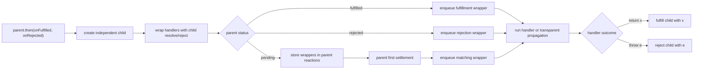

# P01 第二阶段检查点：Child Promise 与普通值传播

> 检查点日期：2026-07-27
>
> 对应课程：P01-L04 · 让 `then` 返回新的 Promise（行为 GREEN）
>
> 下一步：先收紧 L04 的内部类型，再进入 P01-L05 · Promise Resolution Procedure

## 本阶段目标

第二阶段在第一阶段的状态机和 reaction scheduler 之上，建立 `parent → handler → child` 的传播模型。重点不是让 parent 拥有更多状态，而是让每一次 `then` 都产生一个拥有独立状态和 settlement capability 的 child：

- 每次 `then` 同步返回一个新的 PromiseLike；
- parent 的最终状态只负责选择本次 reaction 的 handler；
- handler 的正常返回值或抛错负责决定对应 child 的结果；
- handler 缺失或不可调用时，parent 的结果透明传播给 child；
- pending 与 already-settled 两种注册时机共享同一套传播语义；
- 多级链通过 scheduler 每次推进一个 reaction job；
- thenable assimilation 明确保留给 P01-L05。

## 核心心智模型

`then` 不是给 parent “追加一个返回值”。它创建一个新的状态机，并把这个 child 的 `resolve` / `reject` capability 捕获到本次 reaction 的 closure 中：

```text
parent settles
  → select the matching handler
  → scheduler runs one reaction job
  → handler returns or throws
  → settle this reaction's child
```

因此两个相邻决定必须分开理解：

1. **Parent 状态选择 handler。** fulfilled 选择 `onFulfilled`，rejected 选择 `onRejected`。
2. **Handler outcome 选择 child 状态。** 正常 return 会 fulfill child，throw 会 reject child。

这也解释了为什么 rejected parent 不意味着 rejected child：`onRejected` 如果正常返回一个普通值，错误已经被处理，child 应进入 fulfilled。

## 普通值传播矩阵

| Parent 结果 | 对应 handler | Handler outcome | Child 结果 |
| --- | --- | --- | --- |
| fulfilled(`value`) | `onFulfilled` | 返回普通值 `x` | fulfilled(`x`) |
| rejected(`reason`) | `onRejected` | 返回普通值 `x` | fulfilled(`x`)，表示恢复 |
| fulfilled / rejected | 匹配的 handler | 抛出 `error` | rejected(`error`) |
| fulfilled(`value`) | `onFulfilled` 缺失或非函数 | 不调用 handler | fulfilled(`value`) |
| rejected(`reason`) | `onRejected` 缺失或非函数 | 不调用 handler | rejected(`reason`) |

当前矩阵中的“返回值”仅指普通值。即使这个值恰好拥有 `.then`，本阶段的 child 仍会直接以该对象 fulfilled；采用 thenable 的最终状态属于下一课。

## Child capability 如何进入 reaction

每次 `then` 都创建一个 child。child executor 收到的 `resolve` / `reject` 被两个内部 runner 捕获：

- fulfillment runner：调用 `onFulfilled`，正常返回时 resolve child，抛错时 reject child；
- rejection runner：调用 `onRejected`，正常返回时同样 resolve child，抛错时 reject child；
- 对应 handler 不可调用时，runner 不执行它，而是透明传播 parent 的 value/reason。

当 parent 尚为 pending，reaction queue 保存的不是原始 public handlers，而是已经绑定了 handler 和 child capability 的 wrapper jobs。这样 parent 将来 settlement 时只需传入 value/reason 并调度匹配 wrapper，不需要重新寻找 child。



## 注册时机与调度

两种注册时机的区别只在于 reaction job 从哪里进入 scheduler：

| 调用 `then` 时的 parent 状态 | Job 来源 | Child 在 flush 前 |
| --- | --- | --- |
| pending | 先保存 wrapper，parent settlement 时 enqueue | pending |
| fulfilled / rejected | `then` 立即 enqueue 匹配 wrapper | pending |

无论从哪条路径进入，handler 都不会在 `then` 的同步调用栈中执行。child 的构造和返回是同步的，reaction job 的执行仍由注入的 scheduler 控制。

所有 children 继承 parent 使用的同一个 scheduler。这让测试可以沿整条链使用 `flushNext()` 逐步推进，也让默认运行时继续使用 microtask。共享 scheduler 不代表共享状态：每次 `then` 都有自己的 child 和 capability。

## Sibling independence 与多级链

同一个 parent 可以产生多个 siblings：

```text
parent
├─ then(handler A) → child A
└─ then(handler B) → child B
```

每个 wrapper closure 只持有对应 child 的 capability，因此 handler A 正常返回、handler B 抛错时，child A 可以 fulfilled，而 child B 可以 rejected；两者不会争用同一个 settlement latch。

多级链则把前一 child 变成下一 link 的 parent：

```text
root --fn1--> child1 --fn2--> child2 --fn3--> child3
```

一次 `flushNext()` 只执行当前已经排队的 reaction。`fn1` 返回并结算 child1 后，child1 才会为 `fn2` 安排下一个 job；所以每一步都能观察到上一层的精确返回值成为下一层 handler 的输入。

## 测试证据

当前共有 35 条 Vitest 测试：

| 测试组 | 数量 | 证明内容 |
| --- | ---: | --- |
| 状态机 | 8 | executor、三态、first-settlement-wins、executor 抛错 |
| Scheduler 与基础 reactions | 8 | 手动 flush、FIFO、pending/settled 注册时机、只运行一次 |
| Runtime microtask | 1 | 默认 handler 在同步代码之后运行 |
| Child Promise | 18 | child identity、传播矩阵、异常、siblings、handler selection、多级链 |

Child Promise 测试特别验证了：

- child 与 parent 不同，两次 `then` 返回的 children 也互不相同；
- handler 在 flush 前不运行，child 仍 pending；
- handler 获得 parent 或上一层 child 的精确值；
- 普通返回对象、recovery result 和 error 都用 `toBe` 验证引用身份；
- pending 与 already-settled 两种注册路径都能结算 child；
- missing handler 在 parent pending 时登记，也能在 settlement 后透明传播；
- 三层链每次 flush 推进一个 handler，并把不同结果逐层传递；
- 再次 flush 不会重复执行已经消费的 reaction。

本检查点的验证门槛：

```bash
pnpm test
pnpm typecheck
pnpm exec tsc --noEmit --noUnusedLocals --noUnusedParameters
git diff --check
```

## 关键失败与修正

| 失败或假阳性 | 根因 | 修正后的不变量 |
| --- | --- | --- |
| `then` 只登记 handler，没有可返回的独立结果 | reaction 未拥有 child capability | 每次 `then` 先创建独立 child，再让 wrapper closure 捕获其 resolve/reject |
| missing handler 让 child 永久 pending | 把“没有 handler”理解为“什么都不做” | missing handler 必须透明传播 parent 的 value/reason |
| truthy 非函数被当成 handler 调用 | 只用 truthiness 判断 callback | 运行时先检查 callable；非函数按 missing handler 处理 |
| settled 路径在 handler 缺失时提前退出 | 没有进入透明传播 runner | settled parent 也始终 enqueue 对应 runner |
| pending reaction 只保存 public handler | parent settlement 时无法找到该 reaction 的 child | 保存绑定了 child capability 的 internal wrappers |
| 链测试只观察调用次数 | 无法证明逐层 value 传播和 child settlement | 保存每层 child，检查 exact handler input 与 exact child result |
| pending missing-handler 测试在 flush 前结束 | 永久 pending 的错误实现也会通过 | flush 后断言 child 的最终状态与原始 value/reason 身份 |

## 当前设计决定

1. **一个 reaction 对应一个 child。** parent 可有多个 reactions，每个 reaction 拥有独立的 child capability。
2. **Parent 结果与 child 结果分层决定。** parent 状态选择 handler，handler outcome 决定 child。
3. **错误处理是一种恢复。** `onRejected` 正常返回时 resolve child，而不是继续 reject。
4. **Handler 缺失表示透明传播。** `then()` 仍会返回最终跟随 parent 普通结果的 child。
5. **注册时机不改变传播语义。** pending 与 settled 路径最终进入相同 runner。
6. **Scheduler 沿链继承。** 每一层保持异步边界，同时让确定性测试可以逐 job 推进。
7. **Settlement 后释放 parent reactions。** job closure 已接管执行所需引用，parent 不再保留已消费队列。

## 当前已知债务

这些问题不改变本检查点的运行时结果，但适合作为进入 L05 前的 REFACTOR：

- `Reaction` 仍被声明为两个可选 public handlers，实际保存的是两个必定存在、返回 `void` 的 internal wrapper jobs；
- resolver/rejecter capability 与 `then` handlers 的类型角色还未完全分开，部分旧测试仍复用 handler 类型保存 capability；
- `isFunction` 的 predicate 使用宽泛的全局 `Function`，后续可收紧为明确 callable signature；
- transparent runner 读取外层 `value` / `reason`，在 first-settlement 不变量下结果正确，但可改用 runner 参数以降低耦合；
- `PromiseLikeType`、handler 和状态值仍广泛使用 `any`，还没有泛型化；
- `getSnapshot()` 仍是学习期观察接口，尚未决定最终公开边界；
- 多级链测试可以进一步直接断言每次 flush 后尚未执行的下游 children 仍为 pending；
- child 测试为了显式展示矩阵保留了较多重复，后续可在不隐藏语义的前提下抽取局部 helper。

## 明确保留给 P01-L05 的边界

当前 handler 返回 PromiseLike、原生 Promise 或任意 thenable 时，child 会直接 fulfilled 为该对象。本阶段尚未实现 Promise Resolution Procedure，包括：

- 读取并采用 thenable 的最终状态；
- 只读取一次 `.then`，并处理 getter 抛错；
- 以 thenable 为 `this` 调用保存的 `then`；
- 对 thenable 的 resolve/reject 建立局部 once guard；
- 处理 resolve 后 reject、resolve 后 throw 等竞争；
- 递归采用嵌套 thenable；
- 检测 child self-resolution cycle；
- 区分“已经 resolve 到 pending thenable”与仍可被 reject 覆盖的状态。

这些能力会改变 child `resolve` 的含义，应作为下一条独立 RED 开始，而不是混入当前普通值传播 checkpoint。

## 下一步自查

在开始类型 REFACTOR 前，应能不看实现回答：

- 为什么 parent rejected 后，child 仍可能 fulfilled？
- 为什么 missing handler 不能让 child 永久 pending？
- pending reaction 为什么必须捕获 child capability，而不是只保存 public handler？
- siblings 为什么可以得到不同状态，而 multi-link chain 又必须逐层依赖前一个 child？
- handler 返回 thenable 时，为什么“直接 fulfill 为该对象”还不符合标准 Promise？
