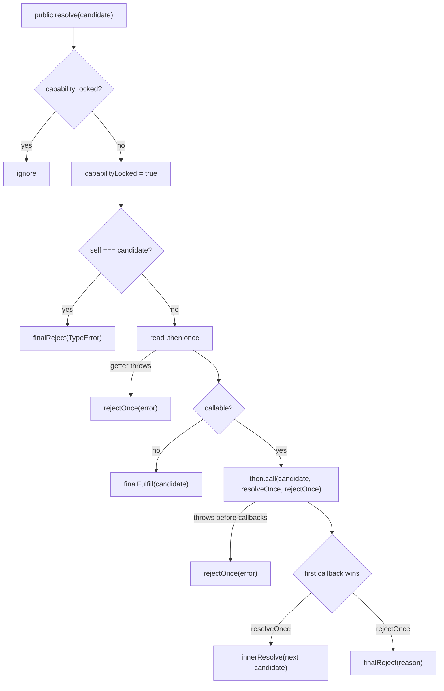

# P01 第三阶段检查点：Promise Resolution Procedure 的三处竞争与 guard 作用域

> 检查点日期：2026-09-28
>
> 对应课程：P01-L05 · 安全执行 Promise Resolution Procedure
>
> 下一步：P01-L06 · 用微任务对齐原生 Promise 调度；P01-L07 的 Promises/A+ 适配器

## 本阶段目标

第三阶段把 `resolve` 从"直接写入终态"升级为完整的 resolution procedure，并分别锁定它引入的三处竞争：

- public capability 只允许第一次调用生效，即使那次调用只是"锁定了采用意图"；
- 每一次对 thenable 的采用都有自己的局部 once guard；
- 终态一旦写入就不可覆盖，且 write 之前必须先判断当前状态。

本阶段的关键不是新增更多状态，而是把"谁保护哪一次竞争"分辨清楚。两把锁的职责不同，任何混用都会在测试中立刻暴露。

## 核心心智模型：Resolved ≠ Settled

```text
public resolve(candidate)
  → capabilityLocked = true          （外层锁：public capability 一次性）
  → status 仍是 pending              （还不是终态）
  → candidate 是 thenable
      → 读取并保存 .then（只读一次）
      → then.call(candidate, resolveOnce, rejectOnce)
          → 局部 once guard            （内层锁：本次采用一次性）
          → 决定 fulfilled / rejected，或继续采用下一个 thenable
```

两把锁必须分开理解：

| 竞争点 | 保护机制 | 不变量 |
| --- | --- | --- |
| executor 里的 public `resolve` / `reject` | 外层 `capabilityLocked` | 只有第一次 public 调用生效；`resolve(thenable)` 之后迟到的 public `reject` 被忽略，反向顺序同理 |
| 同一次 `then` 调用拿到的 inner `resolve` / `reject` | 该次采用的局部 `called` 标记 | 只有第一个 callback 生效；先 reject 时迟到 candidate 的 `.then` 不会被读取 |
| 写入终态 | `status !== "pending"` 时直接 return | fulfilled / rejected 都是终态，不会被后来者覆盖 |



## 本阶段新增的三条 guard test

三条测试都在 `describe("MyPromise thenable")` 内，都不使用 scheduler / flush，因为这三条路径不经过 reactions。

| 测试 | 观察的竞争 | 判别断言 |
| --- | --- | --- |
| `ignores the public reject that arrives after resolve locks onto a thenable` | 外层锁 vs 迟到的 public reject | `toEqual({ status: "pending" })` 两次；inner resolve 后 `value` 用 `toBe` |
| `rejects immediately when the public reject happens before a late resolve(thenable)` | 外层锁是否在进入采用流程**之前**短路 | `readCount === 0`（`.then` getter 从未被读取） |
| `keeps the thenable-local once guard independent for each promise that adopts the same thenable` | 内层 guard 的作用域 | 构造后 `readCount === 2`；p1 fulfilled、p2 rejected，值/因都用 `toBe` |

三条测试与已有的嵌套采用用例共同构成三角覆盖，每种错误实现都有明确的判别者：

| 错误实现 | 被哪条用例打回 | 失败形态 |
| --- | --- | --- |
| 迟到 public reject 仍能改写状态 | 第 1 条 | `status` 变成 `rejected` |
| 外层锁没有短路，采用流程仍被执行 | 第 2 条 | `readCount` 变成 1 |
| 按 candidate 记忆化采用结果 | 第 3 条 | `readCount` 变成 1 |
| 内层 guard 被多个 promise 共享 | 第 3 条 | p2 永久 `pending` |
| 内层 guard 提到 Promise 闭包（粒度过粗） | 已有 `ignores rejection after a thenable resolves to a pending thenable` | 嵌套采用的 parent 永久 `pending` |

## 实验证据一：guard 作用域

为了确认"guard 提到更外层"究竟会被哪条用例抓住，本项目做了一次**只读**实验：把 `promise.ts` 复制到临时目录，机械生成两个变体，再跑两个等价场景。项目源码全程未被修改，实验脚本在确认结论后已删除。

```text
promise.base.ts  nested-adoption: fulfilled (identity ok)
                 two-parents:     reads=2 captures=2; p1=fulfilled (identity ok); p2=rejected (identity ok)
promise.a.ts     nested-adoption: status=pending          ← 每个 Promise 一份 called
                 two-parents:     reads=2 captures=2; p1=fulfilled (identity ok); p2=rejected (identity ok)
promise.b.ts     nested-adoption: status=pending          ← 所有 Promise 共享一份 called
                 two-parents:     reads=2 captures=2; p1=pending; p2=pending
```

三条结论：

1. 内层 guard 的正确粒度**恰好等于一次 `then.call(candidate, resolveOnce, rejectOnce)` 调用**——不是每个 Promise 一份，也不是每个 candidate 一份，更不是模块级一份。
2. "同一 thenable 被两个 promise 采用"这条测试**抓不到**"提到 Promise 闭包"的错误；真正抓住它的是已有的嵌套采用用例，失败形态是 parent 永不 settle。
3. `readCount` 断言不能判别 guard 作用域（三个变体都是 `reads=2`），它判别的是"有没有按 candidate 记忆化采用结果"。两条断言各管一个坏实现。

## 实验证据二：环形 thenable

同一次实验还探测了环形 thenable（原生 Promise 与当前实现各自在独立子进程运行，并加了硬超时）：

```text
native self-cycle     killed after 1500ms (never settled, event loop starved)
native two-node-cycle killed after 1500ms (never settled, event loop starved)
mine   self-cycle     {"status":"pending"}
mine   two-node-cycle {"status":"pending"}
```

可观察结果一致（都永不 settle），但机制不同：

- 原生是**微任务饥饿**：每次采用都排入新的 microtask，事件循环中其他任务永远轮不到。
- 当前实现是**同步递归撞栈后被局部 once guard 吞掉**：`RangeError: Maximum call stack size exceeded` 从最深一层的 `then.call` 抛出，被该层的 `catch (error) { rejectOnce(error) }` 接住；但那一层的 `called` 早已为 true，reject 因此被忽略。这个"吞掉"沿调用栈逐层重复，Promise 最终静默停在 pending。

规范只要求直接 self-resolution 报 `TypeError`（已有用例覆盖并 GREEN），所以环形 thenable 不是本阶段的 Required 项。但由此产生一个**未验证的假设**：合法但很深的 thenable 嵌套可能同样被静默吞掉 `RangeError`，表现为永不 settle 而不是显式失败。该假设属于错误传播策略，不属于 L05 的采用语义，留给后续实验。

## 测试证据

当前 Promise 包共有 54 条 Vitest 测试：

| 测试组 | 数量 | 证明内容 |
| --- | ---: | --- |
| 状态机 | 8 | executor、三态、first-settlement-wins、executor 抛错 |
| Scheduler 与基础 reactions | 8 | 手动 flush、FIFO、注册时机、只运行一次 |
| Runtime microtask | 1 | 默认 handler 在同步代码之后运行 |
| Child Promise | 18 | child identity、普通值传播、异常、siblings、多级链 |
| Thenable resolution | 19 | 采用、单次读取、`this` 绑定、getter/call 抛错、嵌套采用、self-resolution、三处竞争与 guard 作用域 |

本检查点的验证门槛：

```bash
pnpm test
pnpm typecheck
pnpm exec tsc --noEmit --noUnusedLocals --noUnusedParameters
git diff --check
```

2026-09-28 提交前结果：`54/54 passed`，`pnpm typecheck` 与 strict unused 退出码均为 `0`，`git diff --check` 退出码为 `0`。

一次值得记录的验证失败：只追加 guard test 但未运行 strict unused 检查时，`54/54 passed` 与 `pnpm typecheck` 同时为绿，而 `pnpm exec tsc --noEmit --noUnusedLocals --noUnusedParameters` 报 `TS6133: 'reject' is declared but its value is never read.`。`noUnusedParameters` 不属于 `strict`，因此两个命令必须都跑，不能用其中一个代替另一个。

## 关键失败与修正

学习者在写这三条测试前给出的失败假设，以及实验或验证给出的修正：

| 失败假设 | 实际结果 | 修正后的不变量 |
| --- | --- | --- |
| 内部 resolve/reject 执行后，public resolve/reject 会失败 | 两把锁互不干涉：public capability 只看 `capabilityLocked`，inner callback 只看本次采用的局部 `called` | 外层锁保护 public 调用；内层锁保护单次采用；两者不能复用也不能互相代替 |
| public reject 后 `resolve(thenable)` 仍然会走完采用流程 | 外层锁在读取 `.then` **之前**返回，getter 读取次数为 0 | 锁的位置决定了可观察副作用的有无，不只是最终状态 |
| 把内层锁提到 Promise 闭包，"同一 thenable 被两个 promise 采用"这条测试会因 `resolve(thenable)` 无法改变 status 而失败 | 该测试完全通过（两个 parent 各有自己的闭包）；真正失败的是已有的嵌套采用用例 | guard 的粒度必须精确到单次采用；更宽的变体由更深的调用链（嵌套采用）暴露，而不是由兄弟调用暴露 |

另一个必须记住的测试设计教训：断言必须落在"错误实现会变、正确实现不变"的量上。第 2 条测试里 `.then` 的读取次数就是这样的量——它把"锁阻止了整条采用流程"与"采用流程跑完才被丢弃"区分开，而只观察最终状态无法区分这两者。

## 复盘（学习者原话）

1. **失败假设**：内部 resolve/reject 执行后 public resolve/reject 会失败；public reject 后 `resolve(thenable)` 会失败；内部锁移动到 Promise 闭包会导致 `resolve(thenable)` 无法改变 status 而失败。
2. **改变理解的证据**：重复调用同一 thenable，验证了 local guard 的作用——两次采用是两个独立流程，各自拥有自己的局部 guard。
3. **仍不确定**：本轮未列出。

对第 3 条的补充（由实验提出，非学习者不确定项）：环形 thenable 的处置策略、深层嵌套下 `RangeError` 被吞掉的可能性，以及 `getSnapshot()` 的公开边界，都属于当前实现已经暴露但尚未决策的开放问题，已登记在下方"已知债务与边界"。

## 当前设计决定

1. **外层锁先于一切副作用。** `capabilityLocked` 在读取 `.then` 之前生效，因此迟到调用连"观察"都不会发生。
2. **内层 guard 按采用分配。** 每次 `innerResolve` 创建新的 `called`，供本次采用的两个 callback 竞争。
3. **终态写入自守。** `finalFulfill` / `finalReject` 先判断 `status !== "pending"`，不依赖调用者保证。
4. **`self === candidate` 在读取 `.then` 之前判定。** 直接 self-resolution 报 `TypeError`，且不会递归读取自身。
5. **判定顺序固定**：self → 读取并校验 `.then`（一次）→ 非 callable 视为普通值 → callable 则以 candidate 为 `this` 调用。
6. **`null` 是普通值。** 类型判断只对 `object` / `function` 读取 `.then`。

## 已知债务与边界

保留给后续课程或实验，不属于本检查点的 Required 项：

- Promises/A+ 一致性测试套件与适配器（L07）；
- 更完整的多次 resolve/reject 竞争矩阵；
- 环形 thenable 的处置策略，以及深层嵌套 `RangeError` 是否被静默吞掉；
- `any` 仍未泛型化；`getSnapshot()` 仍为学习期观察接口；
- 第 3 条测试尚未在 p2 settle 之后回头再断言 p1 未被波及（可选加固）；
- `TASKS.md` 中 P01-L01 的勾选状态未核对。

## 下一步自查

在进入 L06 之前，应能不看实现回答：

- 为什么"锁在读取 `.then` 之前"比"最终状态正确"更强？两者的可观察差异在哪里？
- 为什么同一 thenable 被两个 promise 采用时 `.then` 应当被读取两次，而单次采用内读取两次就是 bug？
- 如果 `finalFulfill` 不检查 `status`，哪一条已有用例会失败？
- 为什么环形 thenable 的原生行为（永不 settle）与当前实现（永不 settle）不能被当作"实现一致"的证据？
