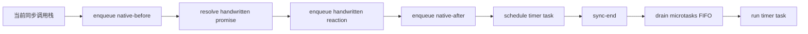

# P01 第四阶段检查点：微任务调度与 Promises/A+ 外部验收

> 检查点日期：2026-09-29
>
> 对应课程：P01-L06 · 用微任务对齐原生 Promise 调度；P01-L07 · 运行 Promises/A+ 兼容测试
>
> 下一步：P01-L08 · Promise 项目验收与复盘

## 本阶段目标

第四阶段用两类外部证据收束当前 Promise 核心：

- 把手写 Promise、原生 Promise 与 timer 放进同一条时间线，验证默认 scheduler 的微任务语义；
- 用 `promises-aplus-tests` 从公共 `then` 接口检验 handler 选择、child 传播与 Promise Resolution Procedure；
- 把 adapter 保持为 API 翻译层，不在桥接代码中增加状态机或解析逻辑；
- 区分实现失败、测试入口问题和测试环境超时，避免为了外部工具误改 Promise 核心。

本阶段没有为通过 A+ 套件修改 `PromiseLike` 的状态机、reaction runner 或 resolution procedure。外部套件直接验收前三个阶段形成的行为。

## 微任务调度的三条时间线

默认 runtime scheduler 使用 `queueMicrotask`。L06 新增三条完整顺序测试，不注入 test scheduler，也不调用 `flushNext()`。

### 已 settled 的手写 Promise 与原生 Promise 交替注册

测试：`runs interleaved native and custom promise reactions in FIFO order`

```text
同步注册：mine-1 → native-1 → mine-2 → native-2

可观察顺序：
sync-end → mine-1 → native-1 → mine-2 → native-2
```

这个结果说明两个实现的 reaction 都进入当前运行时的微任务队列。Promise 的创建顺序不会把同一 Promise 的 handlers 自动分组；决定顺序的是 reaction job 的入队顺序。

### pending 时注册，随后同步 settle

测试：`runs pending reactions before timer tasks after synchronous settlement`

```text
注册手写 handler
  → 同步 resolve
  → 安排 timer
  → sync-end
  → 手写 handler
  → timer
```

`resolve` 同步决定状态并为已登记的 reaction 入队，但 handler 仍越过当前调用栈。微任务在 timer task 之前执行。

### 在 pending settlement 前后插入原生 reaction

测试：`preserves FIFO order for native and custom reactions around pending settlement`

```text
注册 native-before
  → resolve 手写 Promise，手写 reaction 此时入队
  → 注册 native-after
  → 安排 timer
  → sync-end

执行：native-before → mine → native-after → timer
```

完整可观察顺序为：

```text
sync-end → np before → mp → np after → timeout
```

这条测试把“注册在前”与“真正入队在前”分开：pending 手写 Promise 的 handler 在注册时只进入 Promise 自己的 reaction queue，直到 `resolveOuter()` 才进入 runtime microtask queue。



## 调度结论

在本阶段覆盖的场景里，使用 `queueMicrotask` 的手写 Promise 与原生 Promise 没有观察到 reaction 顺序差异。两者都遵守当前微任务队列的 FIFO 顺序。

这项结论有明确边界：它只说明所测注册时机和 timer 相对顺序一致，不等于手写实现复制了 ECMAScript Promise Jobs 的全部 host 行为。若把 runtime scheduler 换成 timer，手写 reaction 会落到后续 task，从而与原生 Promise 产生可观察顺序差异。

## Promises/A+ adapter

`promises-aplus-tests` 不认识项目的函数名、状态字段或 `getSnapshot()`。它只要求一个标准化入口：

```text
adapter.deferred()
  → {
      promise,
      resolve,
      reject
    }
```

adapter 在 `PromiseLike` executor 同步执行时捕获 resolve / reject capability，并把它们与 Promise 一起返回。它不直接访问或改写 `status`，也不复制 resolution procedure。

两条本地 adapter 测试分别证明：

| 测试 | 证明内容 |
| --- | --- |
| `exposes a pending promise and external settlement capabilities` | 初始 pending；外部 resolve / reject 能驱动对应终态；handlers 在 settlement 前不执行；value / reason 保持身份 |
| `exposes deferred through the A+ adapter contract` | `deferred` 是函数；每次调用产生独立 promise 与 capabilities；一个实例 settlement 不影响另一个实例 |

### adapter 实现过程中暴露的错误

最初版本让 executor 参数与外层变量同名：

```text
outer resolve = noop

executor(resolve) {
  resolve = resolve
}
```

参数遮蔽导致赋值发生在参数自身，返回给测试的外层 capability 仍是空函数，因此调用后 Promise 永远 pending。修正方式是让外层保存槽与 executor 参数使用不同名称，明确完成“捕获 capability”这一步。

这次失败再次说明：handler 是否被调到只能证明一部分行为。adapter smoke test 还必须直接证明 `pending → fulfilled` 与 `pending → rejected` 的状态转换。

## TypeScript 与 runner 接入

项目是 TypeScript ESM，而 `promises-aplus-tests@2.1.2` 的 CLI 使用 CommonJS `require(adapterPath)` 加载入口。直接把当前 `.ts` / ESM 模块交给 CLI 会遇到模块格式边界。

本项目选择在 Vitest 中调用套件的 programmatic runner：

```text
Vitest 负责加载 TypeScript / ESM
  → 把现有 adapter 对象传给 A+ runner
  → 用原生 Promise 包装 runner callback
  → callback error 使 Vitest test rejected
  → callback null 使 Vitest test fulfilled
```

`promises-aplus-tests` 没有自带 TypeScript 声明，因此新增最小本地声明 `promises-aplus-tests.d.ts`。声明只覆盖本项目实际使用的 runner、adapter、options 与 callback，不把第三方模块整体降级为 `any`。

A+ runner 会在缺少 `resolved(value)` / `rejected(reason)` 时，使用 `deferred()` 自动补齐它们。因此当前 adapter 只实现核心入口 `deferred`。

## 第一次完整运行与超时判断

运行环境：

| 项目 | 版本或设置 |
| --- | --- |
| Node.js | `v26.10.0` |
| pnpm | `12.6.0` |
| Vitest | `4.1.10` |
| promises-aplus-tests | `2.1.2` |
| 外层 Vitest timeout | `30_000ms` |
| 最终内部 Mocha timeout | `1_000ms` |

首次完整接入可以通过全部 A+ 用例，但一次稳定性复跑出现：

```text
871 passing
1 failing

2.3.4 / value is undefined / eventually-rejected
timeout of 200ms exceeded
```

失败发生在测试套件自己的 `eventually-rejected` 场景。该 helper 先等待 `50ms` 才调用 adapter 的 reject；失败栈显示目标 fulfillment handler 最终到达，但到达时 Mocha 的 `done()` 已超过默认 `200ms` 时限。同一份代码原样复跑又全绿，说明现象不稳定。

据此形成并验证了两个假设：

| 假设 | 证据 | 结论 |
| --- | --- | --- |
| Promise 的 2.3.4 普通值传播有确定性缺陷 | 同一用例原样复跑通过；前三阶段已有普通值与 rejection recovery 的聚焦测试 | 不支持该假设 |
| Vitest 内嵌 Mocha 时，默认单用例 `200ms` 对带 `50ms` timer 的用例过紧 | 失败是超时；核心实现不变，仅把内部 timeout 提高到 `1_000ms` 后连续两次完整通过 | 支持该假设 |

外层 Vitest 的 `30_000ms` 控制整条 conformance test，不能替代内部 Mocha 对每个 A+ 用例的 timeout。最终同时保留两层设置。

本轮没有为了这个偶发超时修改 `PromiseLike`。提高测试套件的时间容差不会改变 Promise 行为预期，只避免环境调度抖动被误判成规范失败。

## 兼容性结果

当前 `promises-aplus-tests@2.1.2` 共运行 872 个用例。把内部 Mocha timeout 调整为 `1_000ms` 后，两次独立完整运行都通过：

```text
872 / 872 passed
872 / 872 passed
```

这证明当前实现的 `then` 满足该套件覆盖的 Promises/A+ 互操作要求，包括：

- 非函数 handler 的透明传播；
- fulfillment / rejection handler 的选择、次数和参数身份；
- handler 越过当前调用栈执行；
- 同一 Promise reactions 的注册顺序；
- 每次 `then` 返回 child，并根据 handler return / throw 决定 child；
- child self-resolution 拒绝；
- then getter、调用时的 `this`、局部 once guard 与嵌套 thenable resolution；
- 非对象、非函数返回值的普通值 fulfillment。

## 测试证据

本阶段把原有 54 条 Vitest 行为测试扩展为：

| 测试层 | 数量 | 证明内容 |
| --- | ---: | --- |
| 原有状态机、reaction、child 与 resolution 测试 | 54 | 前三个阶段建立的内部行为与边界 |
| L06 runtime scheduling 测试 | 3 | settled / pending 注册时机、原生 reaction 交错、microtask 与 timer 顺序 |
| adapter smoke tests | 2 | 外部 capabilities、实例独立性与 A+ adapter 契约 |
| A+ wrapper test | 1 | 调用外部 runner，并把 callback 结果传播给 Vitest |
| A+ conformance cases | 872 | 从公共 `then` 接口执行的外部兼容测试；不计入 Vitest 的 60 条 wrapper 统计 |

最终验证门槛：

```bash
pnpm test
pnpm typecheck
pnpm exec tsc --noEmit --noUnusedLocals --noUnusedParameters
git diff --check
```

本阶段验证结果：本地 `60/60` Vitest tests passed，其中 A+ wrapper 内部为 `872/872`；普通类型检查、strict unused 检查与 diff check 均退出码 `0`。

## 复盘（学习者原话与校准）

学习者形成的调度结论：

1. 两个已经 settled 的 Promise，其 reaction 按实际注册 / 入队顺序执行。
2. 同步流程完成任务注册；当前调用栈结束后先排空微任务，再执行 timer task。
3. 手写 Promise 使用 `queueMicrotask` 时，本阶段场景未观察到与原生 Promise 的调度差异；若改用 timer scheduler，才会出现可观察差异。

学习者形成的兼容性结论：

1. Promises/A+ 主要验证 `promise.then(onFulfilled, onRejected)` 的行为。
2. A+ 全绿只代表 `then` 满足该规范的互操作要求，不代表实现了完整原生 Promise。
3. 测试套件的环境超时应先从 runner 时限、定时器与复现稳定性判断，不能因为一次超时直接修改 Promise 核心。

## 当前设计决定

1. **runtime reactions 使用微任务。** 默认 scheduler 使用 `queueMicrotask`；可控 test scheduler 继续用于确定性单元测试。
2. **注册时机不改变异步边界。** settled 后注册和 pending 时注册最终都通过 scheduler 执行 handler。
3. **adapter 只翻译公共 API。** `deferred()` 捕获公开 executor capabilities，不读取内部状态来驱动 Promise。
4. **A+ runner 通过 programmatic API 接入。** Vitest 负责 TS / ESM 加载，runner callback 决定 wrapper test 的 fulfilled / rejected。
5. **两层 timeout 分工明确。** 外层限制整套运行时间，内部限制单个 Mocha 用例；当前内部设置为 `1_000ms`。
6. **外部失败先按条款和稳定性分类。** 确定性规范失败才应提取回归测试并修改实现；本轮唯一失败属于测试环境超时。

## A+ 全绿没有证明什么

Promises/A+ 聚焦 `then` 互操作。当前外部全绿没有替项目证明下列能力：

- 原生 `Promise` 构造器的全部 ECMAScript 细节；
- 所有 host 下与原生 Promise 完全一致的 job 调度；
- `catch`、`finally`、`all`、`race`、`allSettled`、`any` 等 API；
- unhandled rejection tracking；
- `Symbol.species`、subclassing 与原生品牌检查；
- 类型泛型、公共 API 稳定性和生产级诊断能力。

项目自己的测试仍负责 executor 同步执行、默认微任务选择、学习期 `getSnapshot()` 以及不属于 A+ 的扩展行为。

## 已知债务与边界

- `any` 尚未泛型化；`getSnapshot()` 仍是学习期观察接口；
- adapter 当前与核心实现位于同一模块，后续可在确定最终公共 API 时拆分；
- 环形 thenable 与合法超深 thenable 的栈行为仍沿用第三阶段记录的开放问题；
- 更完整的 resolve / reject 重复竞争矩阵仍是可选加固；
- 尚未实现 `catch`、`finally` 与静态组合器；
- 本阶段没有制造虚假的 Promise 回归测试来对应 runner timeout；超时证据记录在本文，而不是混入 Promise 行为测试。

## 进入项目验收前的自查

- 为什么 pending 时调用 `then` 不代表 reaction job 已经进入 runtime microtask queue？
- 为什么两个不同 Promise 的 reactions 也能按同一个 FIFO 顺序执行？
- A+ adapter 为什么不应该读写 `status`？
- A+ 全绿主要证明哪个公开方法，哪些原生 Promise 能力仍未覆盖？
- 如何用“能否稳定复现、失败条款、调用栈和测试时限”区分实现缺陷与 runner 抖动？
- 如果未来出现确定性的 A+ 失败，为什么应先提取最小回归测试，再修改实现？
